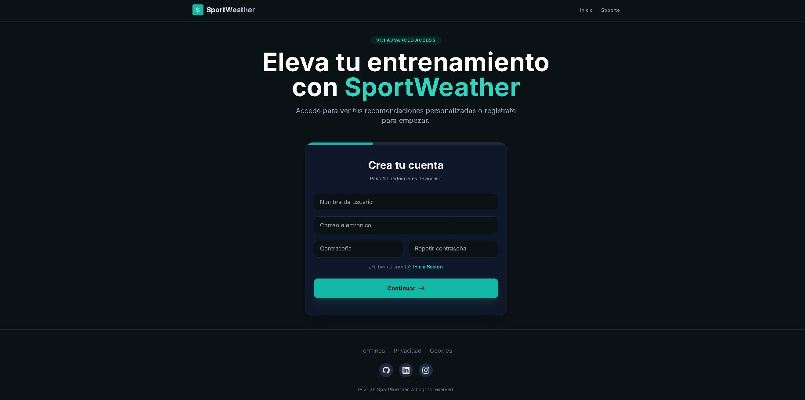
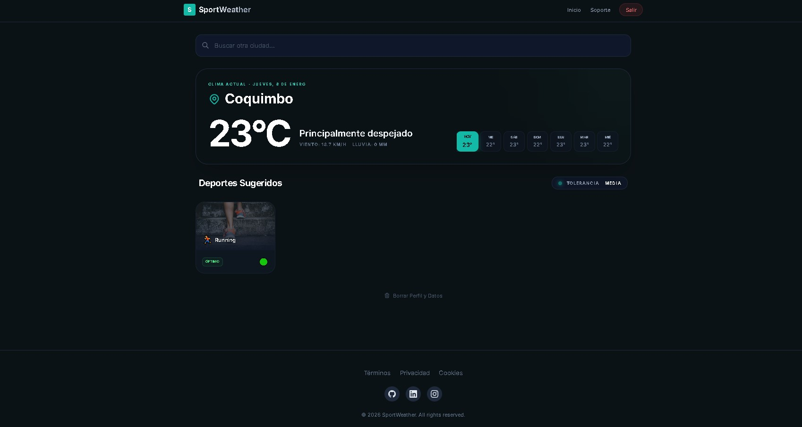
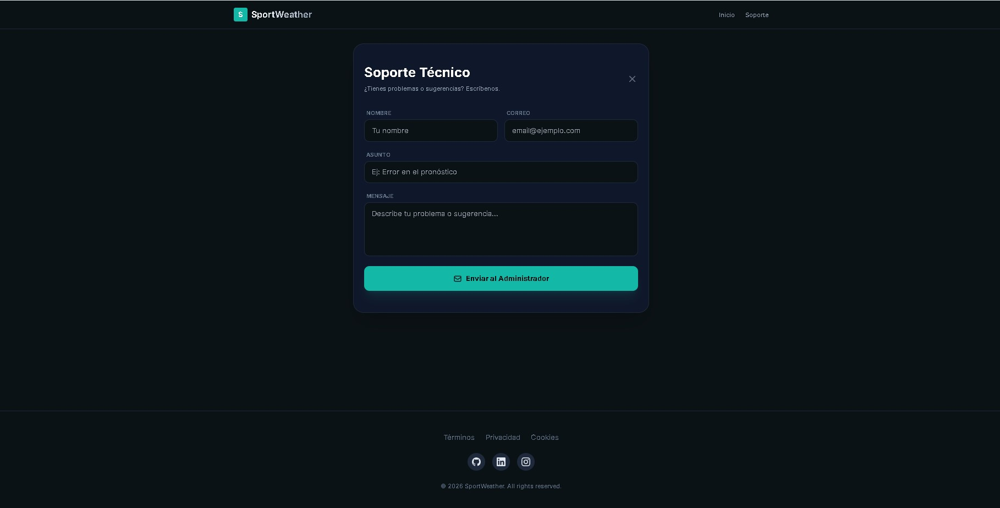

# 🌤️ SPORTWEATHER - Documentación Completa


**SportWeather** es una aplicación web inteligente que ayuda a los deportistas a decidir qué actividad practicar según las condiciones climáticas. Con un sistema de seguridad robusto, rate limiting avanzado y una interfaz moderna, SportWeather combina tecnología de punta con una experiencia de usuario excepcional.

🔗 **Demo en vivo:** [https://sportweather.vercel.app](https://sportweather.vercel.app)

---

## 📸 Screenshots

### Registro de Usuario (Onboarding)


### Dashboard Principal


### Página de Soporte


---

## 📋 Tabla de Contenidos

1. [Características Principales](#-características-principales)
2. [Stack Tecnológico](#️-stack-tecnológico)
3. [Instalación Rápida](#-instalación-rápida)
4. [Configuración Detallada](#-configuración-detallada)
5. [Estructura del Proyecto](#-estructura-del-proyecto)
6. [Seguridad](#-seguridad)
7. [Características Implementadas](#-características-implementadas)
8. [Guía de Uso](#-guía-de-uso)
9. [Despliegue](#-despliegue)
10. [Troubleshooting](#-troubleshooting)
11. [Contribuir](#-contribuir)

---

## ✨ Características Principales

### 🎯 **Funcionalidades Core**
- ✅ **Pronóstico de 7 días** con datos precisos de Open-Meteo
- ✅ **Recomendaciones personalizadas** de deportes según clima y tolerancia
- ✅ **Búsqueda global de ciudades** con geocoding avanzado
- ✅ **Ubicación GPS automática** sin límites de uso
- ✅ **Interfaz moderna** con Tailwind CSS y animaciones suaves

### 🔐 **Seguridad Avanzada**
- ✅ **Content Security Policy (CSP)** - Protección contra XSS
- ✅ **Row Level Security (RLS)** - Control de acceso a nivel de fila
- ✅ **Rutas Protegidas** - Acceso restringido vía React Router
- ✅ **Protección de Email** - Verificación de existencia para evitar errores
- ✅ **Rate Limiting Inteligente** - 7 ciudades únicas cada 7 días
- ✅ **Doble Candado** - Validación por `user_id` + `email`
- ✅ **Autenticación Supabase** - JWT tokens seguros

### 🚀 **Rendimiento**
- ✅ **Vite** - Build ultrarrápido con HMR
- ✅ **React 19** - Concurrent rendering mejorado
- ✅ **Índices optimizados** en PostgreSQL
- ✅ **Caché inteligente** de búsquedas
- ✅ **Limpieza automática de localStorage** - Previene memory leaks (nuevo v1.1)

### 🧹 **Sistema de Limpieza Automática (v1.1)**
- ✅ **Limpieza periódica** cada 30 minutos
- ✅ **Protección de sesión** - Las claves de Supabase nunca se eliminan
- ✅ **Prevención de memory leaks** - Refs para controlar componentes montados
- ✅ **Cleanup de timeouts** - Todos los timers se cancelan al desmontar

---

## 🛠️ Stack Tecnológico

### **Frontend**
```
React 19.2.3          - UI Library (Concurrent Rendering)
React Router 7.12.0   - Navigation & Clean URLs
TypeScript 5.8.2      - Type Safety
Vite 6.2.0            - Build Tool (HMR ultrarrápido)
Tailwind CSS 4.1.18   - Styling (JIT Compiler)
```

### **Backend**
```
Supabase              - BaaS (PostgreSQL + Auth + Storage)
PostgreSQL 15         - Base de datos relacional
Row Level Security    - Seguridad a nivel de fila
```

### **APIs Externas**
```
Open-Meteo API        - Datos meteorológicos (gratuita)
Nominatim OSM         - Geocoding y reverse geocoding
EmailJS               - Envío de emails de soporte
```

### **Seguridad**
```
Content Security Policy (CSP)
X-Frame-Options
X-Content-Type-Options
Referrer-Policy
Rate Limiting (ciudades + emails)
```

---

## 🚀 Instalación Rápida

### **Requisitos Previos**
- Node.js 18+ ([Descargar](https://nodejs.org/))
- npm o yarn
- Cuenta de Supabase ([Crear gratis](https://supabase.com))
- Cuenta de EmailJS ([Crear gratis](https://emailjs.com))

### **Instalación en 3 pasos**

```bash
# 1. Clonar el repositorio
git clone <https://github.com/bryansuarezdev/sportweather>
cd sportweather

# 2. Instalar dependencias
npm install

# 3. Configurar variables de entorno
cp .env.example .env.local
# Edita .env.local con tus credenciales

# 4. Ejecutar en desarrollo
npm run dev
```

La app estará disponible en `http://localhost:5173` o `http://localhost:3000/`

---

## ⚙️ Configuración Detallada

### **1. Variables de Entorno**

Crea un archivo `.env.local` en la raíz:

```env
# Supabase Configuration
VITE_SUPABASE_URL=https://tu-proyecto.supabase.co
VITE_SUPABASE_ANON_KEY=tu_anon_key_aqui

# Supabase Edge Functions
VITE_SUPABASE_FUNCTIONS_URL=https://tu-proyecto.supabase.co/functions/v1

# EmailJS Configuration (para envío de emails de soporte)
VITE_EMAILJS_SERVICE_ID=tu_service_id
VITE_EMAILJS_TEMPLATE_ID=tu_template_id
VITE_EMAILJS_PUBLIC_KEY=tu_public_key
```

> ⚠️ **Importante:** Nunca commitees el archivo `.env.local` a Git.

---

### **2. Configuración de Supabase**

#### **2.1. Crear Proyecto**

1. Ve a [app.supabase.com](https://app.supabase.com)
2. Click en **"New Project"**
3. Configura:
   - **Name:** SportWeather
   - **Database Password:** (guárdala de forma segura)
   - **Region:** Elige la más cercana a tus usuarios
4. Espera ~2 minutos a que se cree el proyecto

#### **2.2. Obtener Credenciales**

1. Ve a **Settings** → **API**
2. Copia:
   - **Project URL** → `VITE_SUPABASE_URL`
   - **anon/public key** → `VITE_SUPABASE_ANON_KEY`

#### **2.3. Ejecutar Migración SQL**

1. Ve a **SQL Editor** en Supabase
2. Click en **"New Query"**
3. Copia y pega el contenido completo de `supabase_auth_migration.sql`
4. Click en **"Run"**
5. Verifica que se crearon:
   - ✅ Tabla `profiles`
   - ✅ Tabla `support_email_limits`
   - ✅ Tabla `city_access_logs`
   - ✅ 5 funciones auxiliares
   - ✅ 12 políticas RLS
   - ✅ 2 triggers automáticos

#### **2.4. Configurar Autenticación**

1. Ve a **Authentication** → **Providers**
2. Activa **Email**:
   - ✅ Enable Email provider
   - ✅ Confirm email (recomendado para producción)
3. Ve a **Authentication** → **URL Configuration**
4. Configura:
    - **Site URL:** `https://sportweather.vercel.app` (producción)
    - **Redirect URLs:**
      ```
      http://localhost:5173/**
      http://localhost:3000/**
      https://sportweather.vercel.app/**
      ```
      *(Nota: Los asteriscos /** permiten redirecciones a cualquier subpágina interna)*

#### **2.5. Configurar Email Templates**

Ve a **Authentication** → **Email Templates** y configura los templates usando el archivo en `docs/EMAIL_TEMPLATES.md` como referencia. Asegúrate de usar la variable `{{ .ConfirmationURL }}` para los enlaces de recuperación.

---

### **3. Configuración de EmailJS**

1. Ve a [emailjs.com](https://emailjs.com)
2. Crea una cuenta gratuita
3. Crea un servicio de email (Gmail, Outlook, etc.)
4. Crea un template de email para soporte
5. Copia las credenciales a `.env.local`

---

### **4. Configuración de Seguridad (CORS)**

**Nota sobre CORS:** En las versiones más recientes de Supabase (2025/2026), el CORS para la API REST se gestiona de forma automática para dominios seguros (HTTPS) como Vercel.

Si necesitas configurar orígenes específicos manualmente o para Edge Functions:
1. Ve a Supabase → **Settings** → **API**.
2. Busca la sección **"CORS"** o **"Allowed Origins"** (si está disponible en tu plan/versión).
3. Agrega tus URLs:
   ```
   https://sportweather.vercel.app
   http://localhost:5173
   http://localhost:3000
   ```

📚 **Documentación completa:** `docs/CORS_CONFIGURATION.md`

---

## 📁 Estructura del Proyecto

```
sportweather/
├── public/                      # Archivos estáticos
├── src/
│   ├── components/              # Componentes React
│   │   ├── Dashboard.tsx        # Panel principal con clima
│   │   ├── Onboarding.tsx       # Registro y login
│   │   ├── Layout.tsx           # Layout principal
│   │   ├── Support.tsx          # Formulario de soporte
│   │   ├── AuthCallback.tsx     # Callback de confirmación email
│   │   ├── ProtectedRoute.tsx   # HOC para protección de rutas
│   │   ├── ResetPasswordPage.tsx # Gestión de nuevas contraseñas
│   │   └── ...
│   ├── services/                # Lógica de negocio
│   │   ├── authService.ts       # Autenticación
│   │   ├── weatherService.ts    # API de clima
│   │   ├── emailService.ts      # Envío de emails
│   │   ├── emailLimitService.ts # Rate limiting emails
│   │   ├── cityLimitService.ts  # Rate limiting ciudades
│   │   ├── supabase.ts          # Cliente Supabase
│   │   └── supabaseClient.ts    # Configuración Supabase
│   ├── utils/                   # Utilidades
│   │   ├── recommendation.ts    # Lógica de recomendaciones
│   │   └── storageCleanup.ts    # Limpieza automática de localStorage (v1.1)
│   ├── types.ts                 # Tipos TypeScript
│   ├── constants.ts             # Constantes (deportes, etc.)
│   ├── App.tsx                  # Componente raíz
│   ├── index.tsx                # Entry point
│   └── index.css                # Estilos globales
├── supabase/
│   ├── functions/               # Edge Functions
│   │   └── delete-user-account/ # Función de borrado de cuenta
│   └── security_audit.sql       # Script de auditoría
├── docs/                        # Documentación
│   ├── CSP_SECURITY.md          # Content Security Policy
│   ├── CORS_CONFIGURATION.md    # Configuración CORS
│   ├── SECURITY_SUMMARY.md      # Resumen de seguridad
│   └── SUPABASE_EMAIL_TEMPLATES.md # Templates de emails de autenticación
├── supabase_auth_migration.sql  # Migración principal
├── vercel.json                  # Configuración de rutas para Vercel (OBLIGATORIO)
├── .env.local                   # Variables de entorno
├── .env.example                 # Ejemplo de variables
├── package.json                 # Dependencias
├── tsconfig.json                # Config TypeScript
├── vite.config.ts               # Config Vite
├── tailwind.config.js           # Config Tailwind
└── README.md                    # Documentacion
```

---

## 🔐 Seguridad

SportWeather implementa **9 capas de seguridad** para proteger tus datos y prevenir abusos.

### **Nivel de Seguridad: 8.5/10** 🛡️

### **Capas Implementadas:**

#### **1. Content Security Policy (CSP)**
**Protege contra:** XSS, Clickjacking, Code Injection

```html
<!-- Implementado en index.html -->
<meta http-equiv="Content-Security-Policy" content="...">
```

**Directivas activas:**
- `default-src 'self'` - Solo recursos del mismo origen
- `script-src` - Control de scripts JavaScript
- `connect-src` - Control de conexiones API
- `frame-ancestors 'none'` - Bloquea iframes
- `upgrade-insecure-requests` - Fuerza HTTPS

📚 **Documentación:** `docs/CSP_SECURITY.md`

---

#### **2. Rate Limiting de Ciudades**
**Protege contra:** Abuso de API, Scraping, Consumo excesivo

**Reglas:**
- 7 ciudades únicas cada 7 días
- Doble candado: `user_id` + `email`
- Ubicación GPS ilimitada
- Ciudades recurrentes sin límite

**Implementación:**
```typescript
// services/cityLimitService.ts
const { allowed, remaining } = await canAccessCity(
  userId, 
  userEmail, 
  cityName, 
  isCurrentLocation
);
```

**Tabla en Supabase:**
```sql
city_access_logs {
  id: UUID
  user_id: UUID (FK a auth.users)
  user_email: TEXT
  city_name: TEXT
  latitude: DECIMAL
  longitude: DECIMAL
  last_accessed: TIMESTAMPTZ
}
```

---

#### **3. Row Level Security (RLS)**
**Protege contra:** Acceso no autorizado, Modificación de datos

**Tablas protegidas:**
- `profiles` - 5 políticas
- `support_email_limits` - 3 políticas
- `city_access_logs` - 4 políticas

**Ejemplo de política:**
```sql
CREATE POLICY "Users can view own profile"
  ON profiles FOR SELECT
  USING (auth.uid() = id);
```

**Auditoría:** Ejecuta `supabase/security_audit.sql` mensualmente

---

#### **4. Autenticación Segura**
**Protege contra:** Acceso no autorizado, Robo de sesiones

- ✅ Passwords hasheados (bcrypt)
- ✅ JWT tokens seguros
- ✅ Confirmación de email
- ✅ Recuperación de contraseña
- ✅ Logout seguro

---

#### **5. Validación de Datos**
**Protege contra:** Inyección SQL, Datos inválidos

**Constraints en PostgreSQL:**
```sql
-- Username: 2-50 caracteres
CONSTRAINT username_length CHECK (char_length(username) >= 2 AND char_length(username) <= 50)

-- Email válido
CONSTRAINT valid_email CHECK (email ~* '^[A-Za-z0-9._%+-]+@[A-Za-z0-9.-]+\.[A-Za-z]{2,}$')

-- Tolerancia válida
CONSTRAINT valid_tolerance CHECK (tolerance IN ('low', 'moderate', 'high'))
```

---

#### **6. Cabeceras de Seguridad HTTP**
**Protege contra:** Clickjacking, MIME sniffing, XSS

```html
<meta http-equiv="X-Frame-Options" content="DENY">
<meta http-equiv="X-Content-Type-Options" content="nosniff">
<meta http-equiv="X-XSS-Protection" content="1; mode=block">
<meta name="referrer" content="strict-origin-when-cross-origin">
```

---

### **Comparación con OWASP Top 10:**

| Vulnerabilidad | Estado | Protección |
|----------------|--------|------------|
| A01: Broken Access Control | ✅ | RLS + Auth |
| A02: Cryptographic Failures | ✅ | Supabase + HTTPS |
| A03: Injection | ✅ | Parameterized queries |
| A04: Insecure Design | ✅ | Rate limiting + CSP |
| A05: Security Misconfiguration | ⚠️ | CORS pendiente |
| A06: Vulnerable Components | ✅ | Deps actualizadas |
| A07: Auth Failures | ✅ | Supabase Auth |
| A08: Software Integrity | ⚠️ | SRI opcional |
| A09: Logging Failures | ⚠️ | Logs básicos |
| A10: SSRF | ✅ | CSP connect-src |

**Resultado:** 8/10 vulnerabilidades cubiertas ✅

📚 **Documentación completa:** `docs/SECURITY_SUMMARY.md`

---

#### **7. Sistema de Limpieza Automática de LocalStorage (v1.1)**
**Protege contra:** Memory leaks, Datos obsoletos, Cuelgues de aplicación

**Problema resuelto:**
La aplicación podía "colgarse" después de estar abierta por mucho tiempo debido a:
- Datos acumulados en localStorage
- Timeouts sin limpiar
- Callbacks ejecutándose en componentes desmontados

**Solución implementada:**

```typescript
// utils/storageCleanup.ts
import { startPeriodicCleanup, cleanupLocalStorage } from './utils/storageCleanup';

// Inicia limpieza cada 30 minutos
const stopCleanup = startPeriodicCleanup(30 * 60 * 1000);

// Limpieza manual cuando sea necesario
cleanupLocalStorage();
```

**Características:**
- ✅ **Limpieza periódica** - Cada 30 minutos automáticamente
- ✅ **Claves protegidas** - Las sesiones de Supabase (`sb-*`) nunca se eliminan
- ✅ **Prefijos limpiables** - `weather_cache_`, `city_search_`, `temp_`
- ✅ **Verificación de montaje** - `isMounted.current` antes de actualizar estado
- ✅ **Cleanup de refs** - Timeouts guardados en refs y cancelados al desmontar

**Archivos modificados:**
- `App.tsx` - Integración del sistema de limpieza
- `components/Dashboard.tsx` - Prevención de memory leaks
- `utils/storageCleanup.ts` - Módulo de limpieza (nuevo)

---

## 🎨 Características Implementadas

### **1. Autenticación Completa**

#### **Registro de Usuario:**
- ✅ Formulario de 3 pasos
- ✅ Validación de email y contraseña
- ✅ Verificación de username único
- ✅ Confirmación por email
- ✅ Pantalla de "Revisa tu email"

#### **Login:**
- ✅ Autenticación con email/password
- ✅ Detección de email no confirmado
- ✅ Mensajes de error específicos
- ✅ Recuperación de contraseña

#### **Gestión de Sesión:**
- ✅ **Persistencia de sesión** automática
- ✅ **Logout seguro** con limpieza de estado
- ✅ **React Router Integration** - URLs limpias (`/dashboard`, `/support`)
- ✅ **Protección de Rutas** - Redirección automática si no hay sesión
- ✅ **Callback automático** después de confirmar email
- ✅ **Redirección inteligente** tras recuperación de contraseña

---

### **2. Perfil de Usuario**

- ✅ Selección de deportes favoritos (8 deportes disponibles)
- ✅ Configuración de tolerancia al clima (baja, media, alta)
- ✅ Actualización de perfil en tiempo real
- ✅ Eliminación de cuenta con cascada automática

---

### **3. Clima y Recomendaciones**

- ✅ Búsqueda de ciudades global con autocompletado y **país identificador**
- ✅ Pronóstico de 7 días con datos precisos de Open-Meteo
- ✅ Recomendaciones personalizadas de deportes según umbrales
- ✅ Sistema de semáforo (🟢 Ideal, 🟡 Aceptable, 🔴 No recomendado)
- ✅ Información detallada (temperatura, viento, lluvia)
- ✅ **Rate Limiting:** 7 ciudades únicas cada 7 días
- ✅ **Ubicación GPS Optimizada:** Con botón manual de solicitud
- ✅ **Detección GPS Robustecida:** Mayor timeout y precisión ajustable
- ✅ **Badge Visual:** Identifica fácilmente "📍 TU UBICACIÓN"

---

### **4. Soporte**

- ✅ Formulario de contacto profesional
- ✅ Límite de 2 emails cada 7 días
- ✅ Envío vía EmailJS
- ✅ Validación de campos
- ✅ Botón de copiar email de soporte

---

### **5. UI/UX Premium**

- ✅ Diseño moderno con Tailwind CSS
- ✅ Animaciones suaves y micro-interacciones
- ✅ Responsive (móvil, tablet, desktop)
- ✅ Dark mode por defecto
- ✅ Gradientes y glassmorphism
- ✅ Feedback visual claro
- ✅ Loading states elegantes

---

## 📖 Guía de Uso

### **Para Usuarios:**

#### **1. Registro**

1. Abre la app
2. Click en **"Regístrate"**
3. Completa los 3 pasos:
   - **Paso 1:** Credenciales (username, email, password)
   - **Paso 2:** Selecciona tus deportes favoritos
   - **Paso 3:** Configura tu tolerancia al clima
4. Click **"Finalizar Registro"**
5. Revisa tu email y confirma tu cuenta
6. Inicia sesión

---

#### **2. Buscar Clima de una Ciudad**

1. Escribe el nombre de una ciudad en el buscador
2. Selecciona de los resultados
3. **Límite:** Puedes buscar 7 ciudades diferentes cada 7 días
4. **Truco:** Puedes volver a consultar ciudades ya buscadas sin límite

---

#### **3. Ver Recomendaciones**

1. Selecciona un día del pronóstico (hoy + 6 días)
2. Revisa las recomendaciones de tus deportes:
   - 🟢 **Verde:** Condiciones ideales
   - 🟡 **Amarillo:** Condiciones aceptables
   - 🔴 **Rojo:** No recomendado

---

#### **4. Usar Ubicación Actual**

1. Permite el acceso a tu ubicación GPS (el navegador preguntará)
2. La app mostrará automáticamente el clima de donde estás
3. **Botón Manual:** Usa el botón "📍 Mi Ubicación" si el navegador no pregunta automáticamente
4. **Ventaja:** La ubicación GPS es **ilimitada** (no gasta cupo)
5. Verás un badge **"📍 TU UBICACIÓN"**

---

#### **5. Contactar Soporte**

1. Click en **"Soporte"** en el menú
2. Completa el formulario
3. **Límite:** 2 emails cada 7 días
4. Si no puedes enviar más emails, usa el botón de copiar email

---

### **Para Desarrolladores:**

#### **Ejecutar en Desarrollo:**
```bash
npm run dev
```

#### **Build para Producción:**
```bash
npm run build
```

#### **Preview del Build:**
```bash
npm run preview
```

#### **Ejecutar Auditoría de Seguridad:**
1. Ve a Supabase → SQL Editor
2. Ejecuta `supabase/security_audit.sql`
3. Revisa los resultados

---

## 🚀 Despliegue

### **Opción 1: Vercel (Recomendado)**

#### **Preparación:**
```bash
npm run build
```

#### **Despliegue:**

1. Ve a [vercel.com](https://vercel.com)
2. Click **"New Project"**
3. Importa tu repositorio
4. Configura:
   - **Framework Preset:** Vite
   - **Build Command:** `npm run build`
   - **Output Directory:** `dist`
5. Agrega las variables de entorno:
   ```
   VITE_SUPABASE_URL
   VITE_SUPABASE_ANON_KEY
   VITE_SUPABASE_FUNCTIONS_URL
   VITE_EMAILJS_SERVICE_ID
   VITE_EMAILJS_TEMPLATE_ID
   VITE_EMAILJS_PUBLIC_KEY
   ```
6. Click **"Deploy"**

#### **Post-Despliegue:**

1. Copia la URL de producción (ej: `https://sportweather.vercel.app`)
2. Ve a Supabase → **Settings** → **API** → **Allowed Origins**
3. Agrega tu URL de producción
4. Ve a Supabase → **Authentication** → **URL Configuration**
5. Actualiza **Site URL** y **Redirect URLs** con tu dominio

---

### **Opción 2: Netlify**

```bash
npm run build
```

1. Ve a [netlify.com](https://netlify.com)
2. Arrastra la carpeta `dist` a Netlify Drop
3. O conecta tu repositorio Git
4. Configura las variables de entorno
5. Actualiza URLs en Supabase

---

### **Opción 3: Servidor Propio (Nginx)**

```nginx
server {
    listen 80;
    server_name tu-dominio.com;
    root /var/www/sportweather/dist;
    index index.html;

    location / {
        try_files $uri $uri/ /index.html;
    }
}
```

---

## 🐛 Troubleshooting

### **Problema: "Auth session missing!"**

**Causa:** El usuario no ha confirmado su email.

**Solución:**
1. Revisa la bandeja de entrada
2. Confirma el email haciendo click en el enlace
3. O desactiva "Confirm email" en Supabase para desarrollo

---

### **Problema: "Email already registered"**

**Causa:** El email ya está en uso.

**Solución:**
1. Usa otro email
2. O recupera la contraseña del email existente
3. O elimina el usuario desde Supabase Dashboard

---

### **Problema: Errores de CSP en consola**

**Causa:** Estás intentando cargar recursos de un dominio no autorizado.

**Solución:**
1. Abre DevTools → Console
2. Identifica el dominio bloqueado
3. Agrégalo a la directiva correspondiente en `index.html`
4. Ejemplo: Si es un script, agrégalo a `script-src`

---

### **Problema: "Has alcanzado el límite de ciudades"**

**Causa:** Ya buscaste 7 ciudades diferentes en los últimos 7 días.

**Solución:**
1. La app mostrará automáticamente tu ubicación actual
2. Puedes seguir consultando ciudades ya buscadas
3. Espera a que se libere un cupo (se muestra el tiempo restante)

---

### **Problema: CORS error en producción**

**Causa:** No agregaste tu dominio de producción a Supabase.

**Solución:**
1. Ve a Supabase → Settings → API → Allowed Origins
2. Agrega tu dominio: `https://tu-app.vercel.app`
3. Guarda los cambios

📚 **Guía completa:** `docs/CORS_CONFIGURATION.md`

---

## 📊 Límites y Consideraciones

### **Supabase (Plan Gratuito):**
- ✅ 500 MB de base de datos
- ✅ 50,000 usuarios activos mensuales
- ✅ 2 GB de transferencia
- ✅ 1 GB de almacenamiento de archivos

### **Open-Meteo (Plan Gratuito):**
- ✅ Ilimitado (API pública)
- ✅ Sin API key requerida
- ✅ Datos meteorológicos precisos

### **EmailJS (Plan Gratuito):**
- ✅ 200 emails por mes
- ✅ 2 templates de email

---

## 📝 Scripts Disponibles

```bash
# Desarrollo
npm run dev

# Build para producción
npm run build

# Preview del build
npm run preview

# Linting
npm run lint

# Type checking
npm run type-check
```

---

## 🤝 Contribuir

1. Fork el proyecto
2. Crea una rama (`git checkout -b feature/AmazingFeature`)
3. Commit tus cambios (`git commit -m 'Add some AmazingFeature'`)
4. Push a la rama (`git push origin feature/AmazingFeature`)
5. Abre un Pull Request

---

## 📄 Licencia

Este proyecto está bajo la Licencia MIT.

---

## 👥 Autor

**SportWeather Team**  
Creado con ❤️ y ☕

---

## 📞 Soporte

¿Necesitas ayuda? 

- 📧 Usa el formulario de soporte dentro de la app
- 📚 Revisa la documentación en `/docs`
- 🐛 Abre un issue en GitHub

---

## 🔗 Enlaces Útiles

- [Documentación de Supabase](https://supabase.com/docs)
- [Documentación de Vite](https://vitejs.dev/)
- [Documentación de Tailwind CSS](https://tailwindcss.com/docs)
- [Open-Meteo API](https://open-meteo.com/)

---

## 📈 Roadmap

### **v1.1 (Próximamente)**
- [ ] MFA (Autenticación de dos factores)
- [ ] Notificaciones push
- [ ] Modo offline
- [ ] Compartir pronósticos

### **v1.2 (Futuro)**
- [ ] App móvil (React Native)
- [ ] Integración con wearables
- [ ] Análisis de tendencias climáticas
- [ ] Comunidad de deportistas

---

**Última actualización:** 2026-01-11
**Versión:** 1.1.0 (Routing Update)
**Nivel de Seguridad:** 🛡️ 8.7/10 (EXCELENTE - Protegido contra Enumeración)
**Estado:** ✅ PRODUCCIÓN READY
